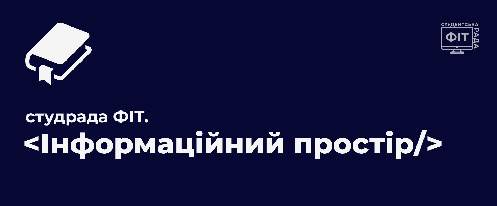
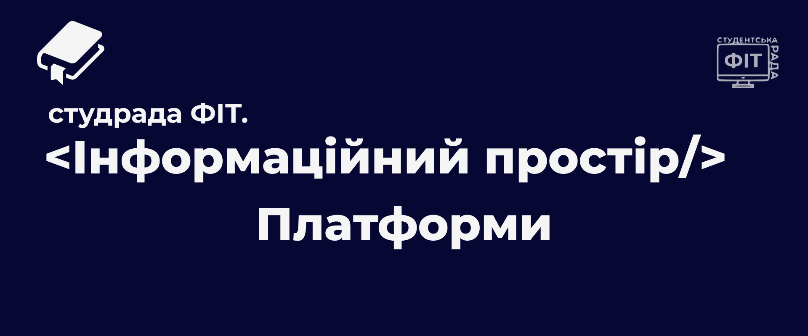
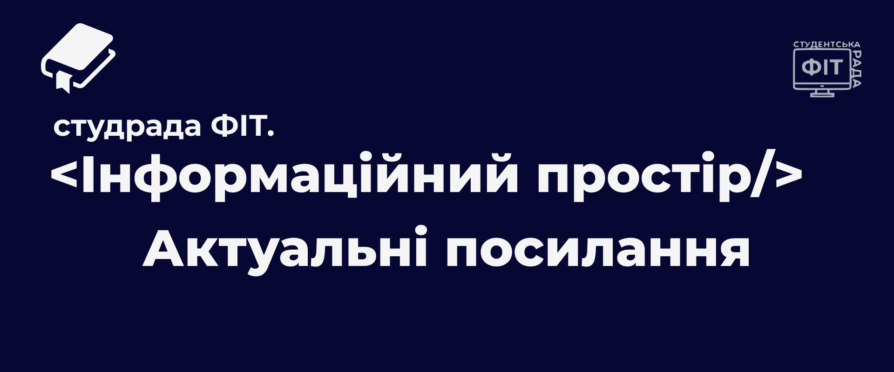

    

    
    
    

    

> [!NOTE]
> Студенська рада ФІТ активно працює для покращення навчання, добробуту та студенського життя наших студентів. Оформіть підписочку на нашу сторінку [Instagram](https://www.instagram.com/sr_fit_khnu/), щоб слідкувати за новими новинами та подіями.  Дякую!

## Information

| Stack                 | Description                                                      | Certified                  | Category | Platform                                                                                                                                                                                                                                        |
| --------------------- | ---------------------------------------------------------------- | -------------------------- | -------- | ----------------------------------------------------------------------------------------------------------------------------------------------------------------------------------------------------------------------------------------------- |
| Python                | Python for database                                              | 
 ✅
   | Course   | <a href="https://prometheus.org.ua/prometheus-free/python-for-databases/"> Open </a>                                                                                                                                                            |
| Python                | Python for webdev                                                | 
 ✅
   | Course   | <a href="https://prometheus.org.ua/prometheus-free/python-for-the-web/"> Open </a>                                                                                                                                                              |
| Python                | Python for newbies                                               | 
❌ 
   | Course   | <a href="https://www.youtube.com/playlist?list=PL7vq4D0vOpQb-nious5dTzUF9GEMp6jiL"> Open </a>                                                                                                                                                   |
| Python                | Python foundation                                                | 
✅  
 | Course   | <a href="https://prometheus.org.ua/prometheus-free/python-fundamentals-for-everyone"> Open </a>                                                                                                                                                 |
| Git                   | Git, Github for newbies                                          | 
 ❌
   | Video    | <a href="https://www.youtube.com/watch?v=9CnZihyYjjA"> Open </a>                                                                                                                                                                                |
| Git                   | Git for software development                                     | 
 ✅
   | Course   | <a href="https://www.google.com/url?sa=t&source=web&rct=j&opi=89978449&url=https://prometheus.org.ua/prometheus-free/git-for-distributed-software/&ved=2ahUKEwiu4KWGsriQAxXNSvEDHbT3Jk0QFnoECB0QAQ&usg=AOvVaw3f3lB0sBiUekQ2yGdYoeeI"> Open </a> |
| Redis                 | Redis for newbies                                                | 
 ❌
   | Video    | <a href="https://youtu.be/45BiGCFU_x8?si=zG8e-MOyQ2BGEcv8"> Open </a>                                                                                                                                                                           |
| Redis                 | Redis foundation                                                 | 
 ❌
   | Video    | <a href="https://youtu.be/X5vVanrGErY?si=KCmvNdM_dZByTMRT"> Open </a>                                                                                                                                                                           |
| Linux                 | Linux foundation                                                 | 
 ❌
   | Video    | <a href="https://youtu.be/FwqQB3z22PE?si=MjZmRGHPmKy_rk7C"> Open </a>                                                                                                                                                                           |
| Linux                 | Linux foundation                                                 | 
 ❌
   | Video    | <a href="https://youtu.be/sciP3DJXTQc?si=_JH-mUWFZkCJvwsl"> Open </a>                                                                                                                                                                           |
| Layout                | HTML, CSS, JavaScript for layout websites                        | 
 ❌
   | Course   | <a href="https://prometheus.org.ua/prometheus-free/programming-fundamentals-html-css-javascript/"> Open </a>                                                                                                                                    |
| Layout                | HTML, CSS, JavaScript foundation                                 | 
❌ 
   | Course   | <a href="https://www.youtube.com/playlist?list=PLaTrkuxDsNd2L_f-O4voEngdn1_aK7qZD"> Open </a>                                                                                                                                                   |
| Java                  | Java for software development                                    | 
 ✅ 
  | Course   | <a href="https://prometheus.org.ua/prometheus-free/java-programming-software-development/"> Open </a>                                                                                                                                           |
| Java                  | Java for newbies                                                 | 
❌ 
   | Course   | <a href="https://www.youtube.com/playlist?list=PL7vq4D0vOpQbW4oply2GMQjVeYHNi05-I"> Open </a>                                                                                                                                                   |
| Java                  | Java foundation                                                  | 
❌ 
   | Course   | <a href="https://www.youtube.com/playlist?list=PLxxPga8YS0l7Bory4_a9RHhg7NAQiCyrq"> Open </a>                                                                                                                                                   |
| Cybersecurity         | Introduction to cybersecurity                                    | 
 ✅ 
  | Course   | <a href="https://prometheus.org.ua/prometheus-free/cs50-cybersecurity/"> Open </a>                                                                                                                                                              |
| C++                   | C++ foundation + OOP                                             | 
 ❌
   | Course   | <a href="https://www.youtube.com/playlist?list=PL7vq4D0vOpQa9WaLe7btV01eixBUZ6-Ve"> Open </a>                                                                                                                                                   |
| C#                    | C# for newbies                                                   | 
❌ 
   | Course   | <a href="https://www.youtube.com/playlist?list=PL7vq4D0vOpQZI9_AZIPGh4nxuePewUR5X"> Open </a>                                                                                                                                                   |
| Blender               | Blender for newbies                                              | 
❌ 
   | Course   | <a href="https://www.youtube.com/playlist?list=PL7vq4D0vOpQYgj8ehcSIvKPmkhLXYw-E0"> Open </a>                                                                                                                                                   |
| Blender               | Blender foundation                                               | 
❌ 
   | Course   | <a href="https://www.youtube.com/playlist?list=PL8tQNNqrETs1vpb5Bbi8VGI-6SCAqCqUS"> Open </a>                                                                                                                                                   |
| JavaScript            | JavaScript for newbies                                           | 
❌ 
   | Course   | <a href="https://www.youtube.com/playlist?list=PL7vq4D0vOpQbGerLS1pEgvPXSLUXgvFEo"> Open </a>                                                                                                                                                   |
| HTML                  | HTML for newbies                                                 | 
❌ 
   | Course   | <a href="https://www.youtube.com/playlist?list=PL7vq4D0vOpQbLLkQTkJIV0rtkHtQ3Pses"> Open </a>                                                                                                                                                   |
| CSS                   | CSS for newbies                                                  | 
❌ 
   | Course   | <a href="https://www.youtube.com/playlist?list=PL7vq4D0vOpQZUc8vHgXKoF-GjXUlVbYT_"> Open </a>                                                                                                                                                   |
| PHP                   | PHP for newbies                                                  | 
❌ 
   | Course   | <a href="https://www.youtube.com/playlist?list=PL7vq4D0vOpQaxbBn9gj2SGq_GdfoOYPo8"> Open </a>                                                                                                                                                   |
| MySQL                 | MySQL for newbies                                                | 
❌ 
   | Course   | <a href="https://www.youtube.com/playlist?list=PL7vq4D0vOpQacwrwL1GWvBlj1_HU6QOdz"> Open </a>                                                                                                                                                   |
| Unity Engine          | Unity Engine for newbies                                         | 
❌ 
   | Course   | <a href="https://www.youtube.com/playlist?list=PL7vq4D0vOpQYVMg_x9tfqQdyF-LE3ar0b"> Open </a>                                                                                                                                                   |
| C                     | C for newbies                                                    | 
❌ 
   | Course   | <a href="https://www.youtube.com/playlist?list=PL7vq4D0vOpQaL3Z9NPCAKlQZb9nL-Z4KT"> Open </a>                                                                                                                                                   |
| Kotlin                | Kotlin foundation                                                | 
❌  
  | Course   | <a href="https://www.youtube.com/playlist?list=PL3o5sNxukLFBJYifmCcHpwXZSql5-OFB0"> Open </a>                                                                                                                                                   |
| Multithreading        | Multithreading, Asynchrony, Parallelism for software development | 
❌ 
   | Course   | <a href="https://www.youtube.com/playlist?list=PL3o5sNxukLFDWj_K2TbX3t7czyIaYz27v"> Open </a>                                                                                                                                                   |
| Dart                  | Dart foundation for mobile development                           | 
❌ 
   | Course   | <a href="https://www.youtube.com/playlist?list=PLjldgCmsTrbXjIzZgudGjGzHyVjZLvA-4"> Open </a>                                                                                                                                                   |
| Figma                 | Figma foundation                                                 | 
❌ 
   | Course   | <a href="https://www.youtube.com/playlist?list=PL8tQNNqrETs2L4E29riLNZPx1U55hmYwd"> Open </a>                                                                                                                                                   |
| UI                    | UI design preview                                                | 
❌ 
   | Course   | <a href="https://www.youtube.com/playlist?list=PL8tQNNqrETs3-PY5ihMfipSkicnhrtSsq"> Open </a>                                                                                                                                                   |
| UI                    | Web UI foundation                                                | 
✅ 
   | Course   | <a href="https://prometheus.org.ua/prometheus-free/web-ui-development-basics"> Open </a>                                                                                                                                                        |
| React                 | React foundation                                                 | 
❌ 
   | Course   | <a href="https://www.youtube.com/playlist?list=PLVSKBfwSePNU34NXQiZ7TWwsnM6jKr72X"> Open </a>                                                                                                                                                   |
| TypeScript            | TypeScript for newbies, foundation                               | 
❌ 
   | Course   | <a href="https://www.youtube.com/playlist?list=PLVSKBfwSePNX6I-IWb8KFPREzYwSf1BBi"> Open </a>                                                                                                                                                   |
| Computer Networks     | Computer Networks foundation (TCP/UDP, OSI)                      | 
❌ 
   | Course   | <a href="https://www.youtube.com/playlist?list=PLjVjn9bYZbjvQaLxF32AD6XVBuH66BK3C"> Open </a>                                                                                                                                                   |
| Computer Architecture | Computer Architecture, repair foundation                         | 
❌ 
   | Course   | <a href="https://www.youtube.com/playlist?list=PL3rfwTch2OWwn9GaNQAPuHVOV3c9Dc90l"> Open </a>                                                                                                                                                   |
| Go                    | Go language for newbies                                          | 
❌ 
   | Course   | <a href="https://www.youtube.com/playlist?list=PLxMmZTMfwi9dem4tOwQ5BZl7OBy8pkw90"> Open </a>                                                                                                                                                   |
| Rust                  | Rust foundation                                                  | 
❌ 
   | Course   | <a href="https://www.youtube.com/playlist?list=PLQqF4TbRWl0faftAUnMd2kWzV8vvvu3oK"> Open </a>                                                                                                                                                   |
| Assembler             | Assembler foundation                                             | 
❌ 
   | Course   | <a href="https://www.youtube.com/playlist?list=PLQqF4TbRWl0flCYyl_yxk5k1nfIrm_mBb"> Open </a>                                                                                                                                                   |
| AWS                   | Amazon Web Services foundation                                   | 
❌ 
   | Course   | <a href="https://www.youtube.com/playlist?list=PLiv5DsFFzt7T_Ca2iuBBWNxuzolJKnTOM"> Open </a>                                                                                                                                                   |
| Docker                | What is docker and what it do                                    | 
❌ 
   | Video    | <a href="https://www.youtube.com/watch?v=dPvXEcIell0"> Open </a>                                                                                                                                                                                |
| Docker                | Docker for frontend devlopers                                    | 
❌ 
   | Video    | <a href="https://www.youtube.com/watch?v=NXoPKCLYjJY"> Open </a>                                                                                                                                                                                |
| PostgreSQL            | PostgreSQL and DBMS                                              | 
❌ 
   | Course   | <a href="https://www.youtube.com/watch?v=mjH4qo8s0n0"> Open </a>                                                                                                                                                                                |
| System Administration | Windows Server administration foundation                         | 
❌ 
   | Course   | <a href="https://www.youtube.com/watch?v=rWLgcbixkF8"> Open </a>                                                                                                                                                                                |
| Blockchain            | Blockchain foundation                                            | 
✅ 
   | Course   | <a href="https://prometheus.org.ua/prometheus-free/solidity-smart-contracts/"> Open </a>                                                                                                                                                        |
| Information security  | Information security foundation                                  | 
✅ 
   | Course   | <a href="https://prometheus.org.ua/prometheus-free/%d1%96%d0%bd%d1%84%d0%be%d1%80%d0%bc%d0%b0%d1%86%d1%96%d0%b9%d0%bd%d0%b0-%d0%b1%d0%b5%d0%b7%d0%bf%d0%b5%d0%ba%d0%b0"> Open </a>                                                              |

 

> [!NOTE]
> Пояснюємо, що означає "Certified" в таблиці. Certified курсами в таблиці вважаються ті, за проходження який в кінцевому результаті ви зможете отримати власний сертифікат про закінчення певного курса!

 

--- 

 

| Name                  | Description                              | Link                                                     |
| --------------------- | ---------------------------------------- | -------------------------------------------------------- |
| Stack Overflow        | Форум з запитаннями для программістів    | <a href="https://stackoverflow.com/questions"> Open </a> |
| IT & Digital Academia | Академія з новинами, подіями ІТ напрямку | <a href="https://t.me/it_academy_ua"> Open </a>          |
| Лекторій              | Канал про освіту, події ІТ і не тільки   | <a href="https://t.me/+-sfcCPOORVQ2MjNi"> Open </a>      |
| Replace               | Український форум программістів          | <a href="https://replace.org.ua/"> Open </a>             |
| Дія.Освіта            | Освітня платформа від Мінцифри           | <a href="https://osvita.diia.gov.ua/ "> Open </a>        |
| IT Education Center Blog | Український блог(статті, новини, порівняння, релізи) | <a href="https://itedu.center/ua/blog/"> Open </a> |
| SourceForge           | Спільнота розробників відкритого программного забезпечення | <a href="https://sourceforge.net/ "> Open </a> | 
| Dou                   | Українська спільнота програмістів        | <a href="https://dou.ua/"> Open </a>

 

--- 

  

 

| Service                           | Link                                     |
|-----------------------------------|------------------------------------------|
| Модульне середовище               | <a href="https://msn.khmnu.edu.ua/"> Open </a> |
| Інформаційна система              | <a href="https://isu1.khmnu.edu.ua/isu/"> Open </a> | 
| Кооперативна пошта                | <a href="https://docs.google.com/forms/d/1cUD9rGjSm4gyIsAwFperLnSpV0FZFPOcVDdoaAe0Sxs/viewform?edit_requested=true"> Open </a> |

 

## Authors

**© Проект створенний Cтуденьскою радою ФІТ Хмельницього Національного Університету, з приводу питаннь просимо звертатись до нашої [інстаграм](https://www.instagram.com/sr_fit_khnu/) сторінки.**

